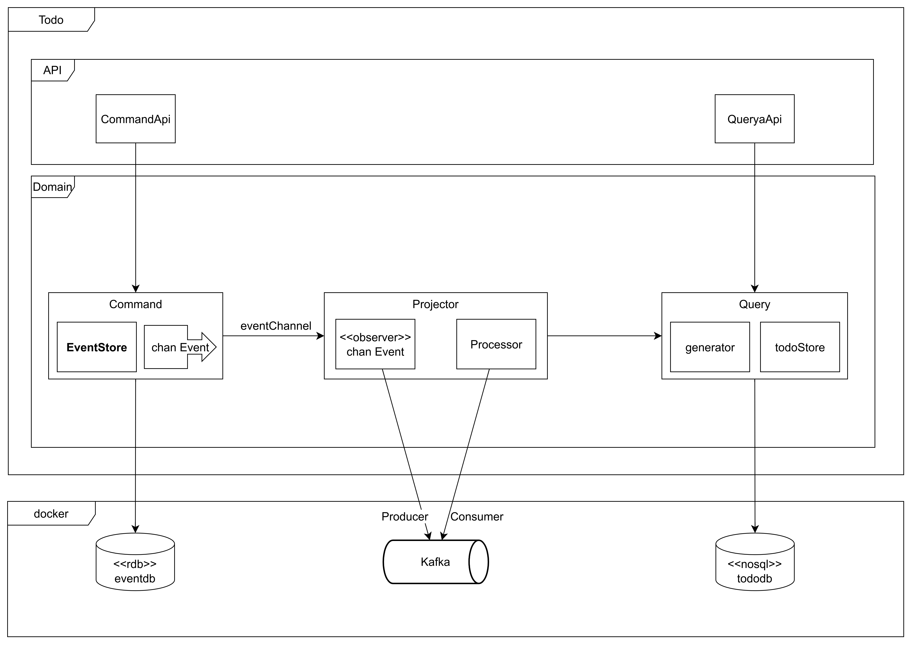

# Golang - RESTFul API

## Description

- Todo List를 관리하는 RESTFul API

## pre-requisites

### Required

- Go 1.20.1
- Postgres
- Docker
- Docker Compose
- MongoDB
- Kafka

### docker-compose

- docker-compose up -d

```yaml
version: "3.9"

networks:
  potato_network:
    driver: bridge

services:
  postgres:
    image: postgres
    restart: always
    container_name: potato_postgres
    ports:
      - "5432:5432"
    environment:
      POSTGRES_USER: potato
      POSTGRES_PASSWORD: 1234

    networks:
      - potato_network
    volumes:
      - ./init.sql:/docker-entrypoint-initdb.d/init.sql

  mongo:
    image: mongo
    container_name: potato_mongo
    environment:
      MONGO_INITDB_ROOT_USERNAME: potato
      MONGO_INITDB_ROOT_PASSWORD: 1234
      MONGO_INITDB_DATABASE: todo_db
    ports:
      - "27017:27017"
    volumes:
      - ./mongo-init.js:/docker-entrypoint-initdb.d/mongo-init.js
    networks:
      - potato_network

  zookeeper:
    image: wurstmeister/zookeeper
    container_name: potato_zookeeper
    ports:
      - "2181:2181"
    networks:
      - potato_network

  kafka:
    image: wurstmeister/kafka
    container_name: potato_kafka
    ports:
      - "9092:9092"
    environment:
      KAFKA_ADVERTISED_HOST_NAME: 127.0.0.1
      KAFKA_ZOOKEEPER_CONNECT: zookeeper:2181
    volumes:
      - /var/run/docker.sock
    depends_on:
      - zookeeper
    networks:
      - potato_network

volumes:
  postgres_data:
  mongo_data:
```

#### postgresql - init.sql

```sql
CREATE
DATABASE event_db;

CREATE
USER event_account WITH PASSWORD '1234';

ALTER
USER event_account WITH SUPERUSER;

GRANT ALL PRIVILEGES ON DATABASE
event_db TO event_account;
```

#### mongo - mongo-init.js

```js
db.createUser({
    user: "todo_account",
    pwd: "1234",
    roles: [
        {role: "readWrite", db: "todo_db"}
    ]
});

db = db.getSiblingDB('todo_db');
db.createCollection('todos');
```

## Project Structure

<div style="background-color: white; display: inline-block;">
    
</div>

## Packages

### 1. config

- Viper를 사용하여 설정 파일을 관리합니다.
- 설정 파일은 config.yaml에 작성합니다. 위치는 아래와 같습니다.
- config.yaml
  ```go
  viper.AddConfigPath(".")
  viper.AddConfigPath("./config")
  viper.AddConfigPath("./cmd")
  viper.AddConfigPath("./cmd/config")
  ```
- 시스템 환경 변수를 위해 viper.AutomaticEnv()를 사용합니다. (추후 k8s 배포시 더 작업 필요)
  ```
  viper.SetEnvPrefix("APP")
  viper.AutomaticEnv()
  ```

### 2. db

- Postgres를 사용하기 위해 GORM과 driver를 사용합니다.
- MongoDB를 사용하기 위해 go.mongodb.org/mongo-driver/mongo를 사용합니다.

```go
func InitPostgresOrExit(cfg *config.DBConfig) (db *gorm.DB, err error) {
// initialize database of EventStore
eventDsn := fmt.Sprintf("host=%s user=%s password=%s dbname=%s port=%s sslmode=disable TimeZone=Asia/Seoul", cfg.Host, cfg.User, cfg.Password, cfg.Database, cfg.Port)
db, err = gorm.Open(postgres.Open(eventDsn), &gorm.Config{})

if err != nil {
logger.Fatalln("Error connecting to database", err)
return nil, err
}

logger.Println("Database initialized")

return db, nil
}

func InitMongoOrExit(cfg *config.DBConfig) (entityStore *mongo.Database) {
// create mongo connection
clientOptions := options.Client().ApplyURI(fmt.Sprintf("mongodb://%s:%s", cfg.Host, cfg.Port)).SetAuth(
options.Credential{
Username:      cfg.User,
Password:      cfg.Password,
AuthMechanism: "SCRAM-SHA-1",
AuthSource:    cfg.Database,
})
client, err := mongo.NewClient(clientOptions)
if err != nil {
logger.Fatalln("Error creating mongo client", err)
}

// connect to mongo
ctx, cancel := context.WithTimeout(context.Background(), 10*time.Second)
defer cancel()
err = client.Connect(ctx)
if err != nil {
logger.Fatalln("Error connecting to mongo", err)
}

return client.Database(cfg.Database)
}
```

- 연결이 안되면 빠이빠이입니다.

### 3. eventChannel

- eventStore에서 발생한 이벤트를 Observer로 전달하기 위해 사용합니다.
- Observer는 Kafka에 Event를 전달합니다.

  ```go
  // init event channel
  eventChannel := make(chan eventModel.Event, 100)
  ```
- 100 크기의 버퍼를 가진 채널을 생성합니다. 실제 Event처리가 느릴 수 있어서 버퍼를 사용합니다.

  ```go
  // init kafka producer
  kafkaProducer := kafka.NewKafkaProducer(cfg.Kafka)
  ```

### 4. eventStore & todoStore

- EventStore는 Event만을 저장하는 저장소입니다.
- TodoStore는 Todo를 저장하는 저장소입니다.

  ```go
  eventStore := command.CreateCommander(cfg.Command, eventChannel) // events -> event store
  todoStore := todo.CreateTodoService(cfg.Query)                   // events -> entity -> pkg store
  ```

### 5. Projector & Generator

- generator는 EventStore에서 발생한 Event를 읽어서 Entity를 생성합니다.
- CQRS는 EventStore에서 저장된 모든 Event를 읽어서 Entity를 생성합니다.
  ```go
  type EntityGenerator interface {
      CreateEntityAnsSave(events []*command.Event) error
  }
  ```

- Projector중 observer는 EventStore에서 발생한 Event를 Kafka로 전달합니다.
  ```go
  generator := todo.NewEntityGenerator(todoStore)                             // events -> entity
  go watcher.CreateProjector(cfg.Projector, eventChannel).Run() // event channel -> kafka
  go watcher.StartEntityGenerator(eventStore, generator, cfg.Projector.Kafka) // kafka -> events -> projector
  ```
- 따라서 domain에서는 Event들을 이용해 Todo를 생성하고 저장하는 내용을 작성해야합니다.
- 아직 go 익숙하지 않아서 코드가 더럽습니다.

## 6. gin

- gin을 사용하여 API를 구현합니다.
- command와 query를 분리하여 구현합니다.

  ```go
  engine := gin.Default()
  todoGroup := engine.Group("")
  
  commandApi.NewTodoRouter(todoGroup, eventStore)
  queryApi.NewTodoRouter(todoGroup, todoStore)
  
  engine.Use(monitoring.LoggingMiddleware())
  
  if err := engine.Run(fmt.Sprintf(":%s", cfg.Server.Port)); err != nil {
      logger.Fatalln("Error running server", err)
  }
  ```

## 7. Monitoring

- LoggingMiddleware이 원하는데로 동작하지 않습니다. 슬프지만 졸립니다.

## 기타
- unit test 고민중입니다. docker 기반의 동작가능한 시스템을 만들어야할까요? 아니면 각각의 package를 테스트할까요?
- 아무래도 먼가 합체가 필요할 것 같습니다.
- Projection 상태를 관리할 TokenStore가 필요합니다. 어떻게 설계해야 하는지 고민중입니다. 아마도 구현한다면 axon framework를 참고할 것 같습니다.
- 최대한 spring 스럽지 않게 구현하려고 노력했습니다. 그래서 CQRS를 구현하는데 있어서 어려움이 있었습니다. CQRS를 구현하는 방법에 대해 조언을 구합니다.
- 아직 go를 잘 모르기 때문에 코드가 더럽습니다. 리뷰 부탁드립니다.
- APM 부터 붙여 보려고 했는데, 아직은 시간이 없습니다. 추후에 붙여보겠습니다.
- Dockerize는 아직 하지 않았습니다. 해봐야 겠네요.
- k8s 배포는 아직 하지 않았습니다. 해봐야 겠네요.
- 엔터를 칠때 마다 copilot이 제안을 해줘서 쓰고 있습니다. 숙제를 많이 주네요.


